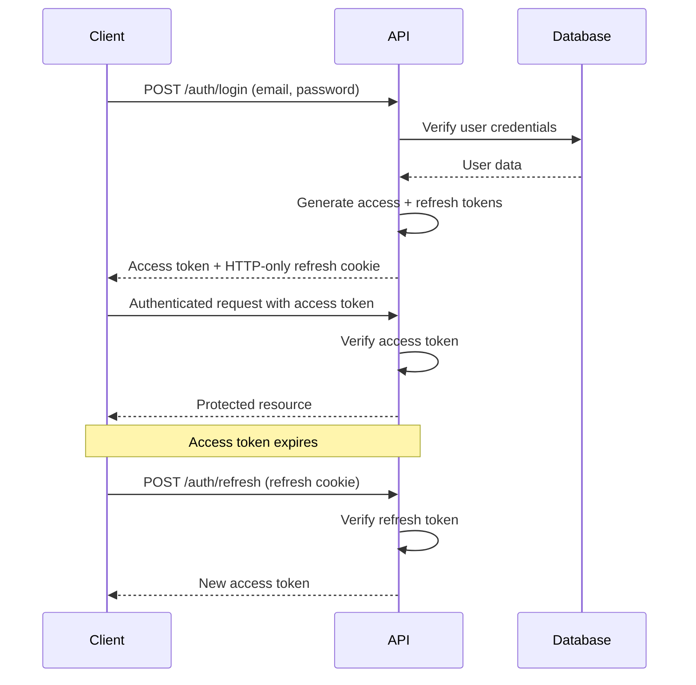

# ADR-004: Authentication Strategy

## Status

Accepted

## Context

The application requires a robust authentication system that supports:
- User registration and login
- Secure password storage
- Session management for web application
- API authentication for future mobile/desktop clients
- Role-based access control
- Future integration with third-party identity providers

The system must balance security, user experience, and implementation complexity.

## Decision

We will implement JWT-based authentication with the following approach:

### JWT Token Strategy
- **Access Tokens**: Short-lived (15 minutes) JWT tokens for API access
- **Refresh Tokens**: Long-lived (7 days) secure tokens for obtaining new access tokens
- **Token Storage**: HTTP-only cookies for web clients, localStorage for mobile/desktop

### Authentication Flow


### Password Security
- **Hashing**: bcrypt with salt rounds (12 rounds minimum)
- **Password Requirements**: Minimum 8 characters, complexity validation
- **Password Reset**: Secure token-based reset flow with expiration

### Implementation Components

#### Middleware
```javascript
// Authentication middleware
const authenticateToken = (req, res, next) => {
  const authHeader = req.headers['authorization'];
  const token = authHeader && authHeader.split(' ')[1];
  
  if (!token) {
    return res.status(401).json({ error: 'Access token required' });
  }
  
  jwt.verify(token, process.env.JWT_SECRET, (err, user) => {
    if (err) return res.status(403).json({ error: 'Invalid token' });
    req.user = user;
    next();
  });
};
```

#### Token Generation
```javascript
const generateTokens = (user) => {
  const payload = {
    id: user.id,
    email: user.email,
    role: user.role
  };
  
  const accessToken = jwt.sign(payload, process.env.JWT_SECRET, {
    expiresIn: '15m'
  });
  
  const refreshToken = jwt.sign(payload, process.env.JWT_REFRESH_SECRET, {
    expiresIn: '7d'
  });
  
  return { accessToken, refreshToken };
};
```

## Role-Based Access Control

### Role Hierarchy
```javascript
const roles = {
  admin: ['all'],
  user: ['read', 'write', 'comment'],
  viewer: ['read']
};

const projectRoles = {
  owner: ['all'],
  editor: ['read', 'write', 'comment', 'invite'],
  viewer: ['read', 'comment']
};
```

### Authorization Middleware
```javascript
const requireRole = (requiredRole) => {
  return (req, res, next) => {
    if (!req.user) {
      return res.status(401).json({ error: 'Authentication required' });
    }
    
    if (!hasPermission(req.user.role, requiredRole)) {
      return res.status(403).json({ error: 'Insufficient permissions' });
    }
    
    next();
  };
};
```

## Security Measures

### Token Security
- **Short expiration times** for access tokens
- **Secure HTTP-only cookies** for refresh tokens in web clients
- **Token rotation** on refresh to prevent replay attacks
- **Revocation capability** for compromised tokens

### Password Security
- **Bcrypt hashing** with high salt rounds
- **Password complexity requirements**
- **Rate limiting** on login attempts
- **Account lockout** after failed attempts

### Additional Security
- **CORS configuration** for allowed origins
- **Rate limiting** on authentication endpoints
- **Request validation** and sanitization
- **Security headers** via helmet.js

## Consequences

### Positive
- Stateless authentication scales well horizontally
- JWT tokens contain user info, reducing database queries
- Refresh token rotation prevents token replay attacks
- Role-based system allows fine-grained permissions
- Compatible with future mobile/desktop applications

### Negative
- JWT tokens cannot be easily revoked before expiration
- Larger payload size compared to session tokens
- Requires careful handling of token storage on client
- Complex refresh token rotation logic

### Security Considerations
- Tokens must be stored securely on client side
- Short token expiration requires robust refresh logic
- Token blacklisting needed for immediate revocation
- Sensitive operations may require re-authentication

## Alternatives Considered

### Session-Based Authentication
- Pros: Easy token revocation, smaller client storage
- Cons: Requires server-side session storage, harder to scale
- Decision: JWT chosen for stateless scaling benefits

### OAuth2 Only
- Pros: Industry standard, delegated authentication
- Cons: Complex implementation, dependency on third parties
- Decision: Custom JWT chosen with future OAuth2 integration path

### Passport.js with Sessions
- Pros: Many strategy options, well-tested library
- Cons: Session storage requirements, less control over token format
- Decision: Custom JWT implementation chosen for API-first design

### Firebase Authentication
- Pros: Managed service, integrated with other Firebase services
- Cons: Vendor lock-in, cost concerns, less control
- Decision: Custom solution chosen for control and cost

## Implementation Plan

### Phase 1: Basic JWT Authentication (Current)
- User registration and login endpoints
- JWT token generation and validation
- Basic role-based access control
- Password hashing with bcrypt

### Phase 2: Enhanced Security
- Refresh token rotation
- Rate limiting and account lockout
- Password reset functionality
- Email verification for new accounts

### Phase 3: Advanced Features
- Two-factor authentication (2FA)
- OAuth2 integration (Google, GitHub)
- Single Sign-On (SSO) capabilities
- Advanced audit logging

### Phase 4: Enterprise Features
- SAML integration
- LDAP/Active Directory integration
- Advanced role management UI
- Compliance features (GDPR, etc.)

## API Endpoints

### Authentication Endpoints
```
POST /auth/register
POST /auth/login
POST /auth/logout
POST /auth/refresh
POST /auth/forgot-password
POST /auth/reset-password
GET  /auth/profile
PUT  /auth/profile
DELETE /auth/account
```

### Authorization Headers
```
Authorization: Bearer <access_token>
```

## Database Schema

### Users Table
```sql
CREATE TABLE users (
    id UUID PRIMARY KEY DEFAULT gen_random_uuid(),
    email VARCHAR(255) UNIQUE NOT NULL,
    password_hash VARCHAR(255) NOT NULL,
    name VARCHAR(255) NOT NULL,
    role user_role DEFAULT 'user',
    email_verified BOOLEAN DEFAULT false,
    failed_login_attempts INTEGER DEFAULT 0,
    locked_until TIMESTAMP,
    created_at TIMESTAMP DEFAULT CURRENT_TIMESTAMP,
    updated_at TIMESTAMP DEFAULT CURRENT_TIMESTAMP
);
```

### Refresh Tokens Table
```sql
CREATE TABLE refresh_tokens (
    id UUID PRIMARY KEY DEFAULT gen_random_uuid(),
    user_id UUID REFERENCES users(id) ON DELETE CASCADE,
    token_hash VARCHAR(255) NOT NULL,
    expires_at TIMESTAMP NOT NULL,
    created_at TIMESTAMP DEFAULT CURRENT_TIMESTAMP,
    revoked_at TIMESTAMP,
    replaced_by_token UUID
);
```

## Testing Strategy

### Unit Tests
- Token generation and validation
- Password hashing and verification
- Role-based permission checks
- Middleware functionality

### Integration Tests
- Complete authentication flows
- Token refresh mechanisms
- Role-based endpoint access
- Security header validation

### Security Tests
- JWT token tampering attempts
- Password brute force protection
- SQL injection prevention
- XSS protection validation

## Monitoring and Logging

### Security Events
- Failed login attempts
- Account lockouts
- Password reset attempts
- Token refresh failures
- Privilege escalation attempts

### Metrics
- Authentication success/failure rates
- Token refresh frequency
- Average session duration
- Role distribution across users

## Environment Configuration

```env
# JWT Configuration
JWT_SECRET=your-super-secret-jwt-key
JWT_REFRESH_SECRET=your-refresh-token-secret
JWT_ACCESS_EXPIRATION=15m
JWT_REFRESH_EXPIRATION=7d

# Security Configuration
BCRYPT_SALT_ROUNDS=12
MAX_LOGIN_ATTEMPTS=5
LOCKOUT_DURATION=30m
PASSWORD_MIN_LENGTH=8
```

## Review Date

This authentication strategy should be reviewed after implementing Phase 2 features or if security vulnerabilities are discovered.

---

*Decision made on: July 25, 2024*
*Last updated: July 25, 2024*
*Status: Accepted*
